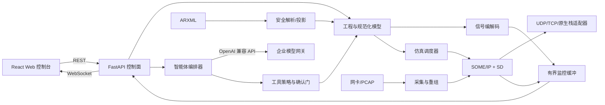
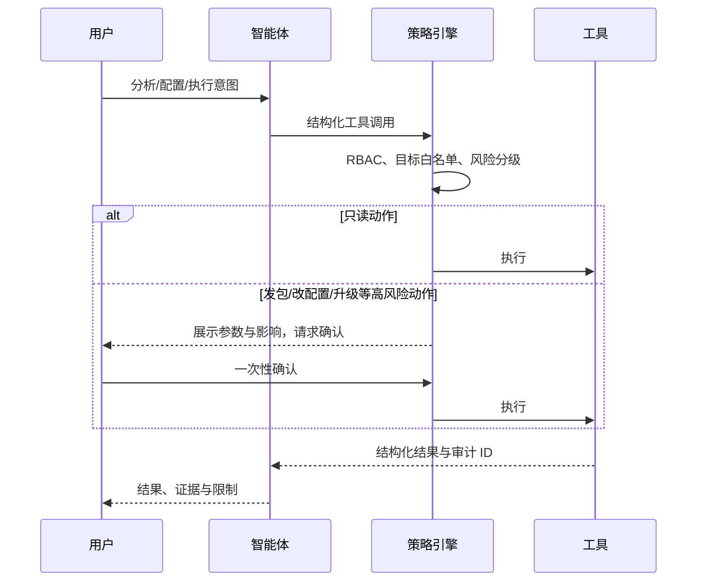

# SOME/IP Agent 系统架构

## 1. 目标与边界

系统服务于车载以太网开发、联调和测试，核心目标是把“数据库导入—协议理解—信号仿真—
在线监控—波形分析—测试自动化—智能体辅助”串成可审计工作流。

设计原则：

1. **安全默认**：未显式授权时不向真实网络发送流量；PCAP 与 ARXML 均视为不可信输入。
2. **模型驱动**：协议运行时只消费规范化中间模型，不让 ARXML 方言渗入每个模块。
3. **数据面与控制面分离**：高频报文路径不等待 LLM，也不把密钥放入浏览器。
4. **适配器隔离**：Python 应用/控制层与 vsomeip 原生数据面通过 socket 适配，业务目录来自源模型。
5. **可复现**：仿真场景、随机种子、数据库哈希、工具版本和结果绑定。

本阶段不是安全认证工具，也不替代 OEM 的协议一致性、功能安全或网络安全认证流程。

当前实现并非“全 Python 协议栈”：SOME/IP/SD 在线通信、服务发现、周期发生器、网卡捕获
和离线重组由独立原生进程及成熟依赖执行。Python 保留 ARXML 投影、页面 API、SAT 风格
字典初始化、IPC 和业务回调。逐条 Python 通知/RPC 仍经过 JSON、socket、线程调度及回调；
监听/捕获/PCAP 的 SD 原始字节解码复用固定 vsomeip SDK 模型，Python 只读结构化结果，
失败保留原始报文而不回退。监控与智能体的 payload 解码也复用在线调用使用的原生 Codec，
按明确 ARXML wire_schema 经持久本地 socket 解码；Python 保留结构校验、物理比例换算与统计，
不以旧 SignalCodec 回退。PCAP/统计按批次解码，原生通信在工作线程中执行，不阻塞页面事件循环。
原生周期发生器只需提交配置一次，但客户端 Python 回调仍有成本。具体短负载证据与未达到
严格周期的观测见 [性能证据](performance.md)，不能用 C++ 底座推导零开销或硬实时。

## 2. 逻辑架构



### 前端

- React + TypeScript + Vite：视图、交互和类型化 API 客户端；
- ECharts：多 Y 轴、缩放、游标、暂停与导出等波形能力；
- 浏览器只持有短生命周期会话，不保存模型 API Key；
- 断线后指数退避重连，明确区分实时数据与演示数据。

### 后端应用层

- FastAPI 提供版本化 REST API 和 WebSocket；
- 路由只负责认证、校验和协议转换，业务逻辑下沉到服务层；
- 统一异常处理返回稳定错误码，服务端 JSON 日志记录完整异常堆栈；
- 长任务采用可取消任务或作业模型，避免阻塞事件循环。

### 领域与协议层

- `domain`：服务、方法、事件、字段、信号、监控消息、仿真会话；
- `arxml`：安全 XML 解析并映射为领域模型；
- `protocol`：SOME/IP 头、消息流和 SOME/IP-SD 条目/选项；
- `pcap`：链路层/IP/传输层解析，输出统一监控消息；
- `simulation`：时间/条件驱动信号源、provider/consumer、状态机和故障注入；
- `agent`：LLM 客户端、上下文构造、工具注册、策略校验和审计。

## 3. 关键数据流

### ARXML 到信号仿真

1. 上传层校验扩展名、大小与内容摘要；
2. XML 解析器关闭 DTD、外部实体、网络访问和超大树；
3. 提取服务部署、实例、端点、方法/事件/字段及数据类型；
4. 解析引用并生成带警告的规范化模型，原文件保持不可变；
5. 用户选择角色、接口、周期和信号源，生成可版本化场景；
6. 经发送策略检查后把配置提交给原生进程，由原生调度器编码并交给 vsomeip；
7. TX/RX 均写入监控总线，形成可回放与审计的证据链。

复杂结构、动态数组、字符串编码、字节序、对齐、TLV 和 E2E 必须由显式类型描述驱动；不允许
在未知布局下“猜测”payload。

### PCAP 到波形

1. PCAP/PCAPNG 以流式方式读取，限定文件、报文和错误数量；
2. 原生成熟依赖解析 Ethernet/VLAN、IPv4/IPv6、UDP/TCP 并重组 TCP，支持范围受验收矩阵约束；
3. 定位 SOME/IP 消息边界并解析 SD；
4. 用当前工程的服务/信号模型解码 payload；
5. 原始报文与信号样本分别进入有界缓存；
6. WebSocket 发送增量，前端按订阅、采样率和时间窗降采样绘制。

高频波形不能逐点无限推送。服务端应使用分桶 min/max/last 或 LTTB 等降采样策略，并给每个
客户端设置队列上限；慢客户端丢弃旧增量后获取快照，不能反压采集线程。

### 智能体工具调用



ARXML 名称、PCAP payload、服务描述和模型输出都是不可信内容，不得把其中的文字当作系统
指令。LLM 不进入数据面；网关不可用时，仿真与监控仍应正常运行。

## 4. API 契约

- 所有业务接口使用 `/api/v1` 前缀；
- REST 适合工程、配置、快照、作业和文件导入；
- WebSocket 只承载实时状态/监控增量，首帧包含协议版本；
- ID 使用稳定 UUID，时间戳使用 UTC ISO 8601；
- 大文件上传采用服务端流式落盘与哈希，禁止一次性无上限读入内存；
- 错误体包含 `code`、`message`、`request_id`，不返回堆栈或密钥；
- 破坏性 API 要求幂等键或乐观版本号。

前端与后端可独立部署，但必须由同一反向代理提供同源 `/api`，或配置受限 CORS。生产环境不
允许通配符 CORS。

## 5. 并发与性能

- asyncio 处理控制面、WebSocket 与原生监控 IPC；在线 SOME/IP/SD I/O 由 vsomeip 处理；
- XML/PCAP 大文件解析放入受限线程池或工作进程；
- 每个仿真会话拥有取消令牌、单调时钟和资源配额；
- 监控环形缓冲默认有界，持久化由可插拔存储异步消费；
- 原生 vsomeip 或高性能抓包适配器通过独立进程接入，崩溃不拖垮 API；
- 对吞吐、丢包、调度抖动、WebSocket 队列深度和 LLM 延迟分别打点。

性能验收必须说明机器、网卡、帧尺寸、协议和采样策略，不能只给“每秒报文数”。

## 6. 安全设计

| 风险 | 默认控制 |
|---|---|
| 误向车辆/台架发包 | `network_send_enabled=false`，目标 CIDR/端口白名单，显式确认 |
| XML 实体与资源耗尽 | 禁止 DTD/实体/网络，大小、深度和数量限额 |
| 恶意 PCAP | 隔离解析、CPU/内存/错误数限额，不自动重放 |
| API Key 泄露 | 服务端 OS 凭据库/密钥管理，日志脱敏，不返回密钥 |
| Prompt Injection | 数据与指令分区、工具参数 schema、最小权限、审批与审计 |
| Web 攻击 | 身份认证、RBAC、同源部署、CSRF/CORS 策略、上传白名单 |
| 供应链 | 锁定依赖、SBOM、许可证与漏洞扫描、可复现构建 |
| 恶意升级 | HTTPS + Ed25519 签名 + SHA-256 + 防降级 + 原子回滚 |

## 7. 版本与升级

`VERSION` 是发布版本源，CI 同时校验：

- `backend/pyproject.toml` 的项目版本；
- `backend/src/someip_agent/version.py` 的 `__version__`；
- `frontend/package.json` 的版本；
- 发布标签 `v<version>`（标签构建时）。

当前后端采用以下最小清单契约：

```json
{
  "version": "0.2.0",
  "download_url": "https://updates.example.com/someip-agent-0.2.0-linux-x64.zip",
  "sha256": "<64 hex characters>",
  "release_notes": "<可选发布说明>",
  "signature": "<base64 Ed25519 signature>"
}
```

签名原文严格为 UTF-8 编码的
`version + "\n" + sha256 + "\n" + download_url`。客户端必须先验证签名，再比较版本和
下载；下载完成后校验哈希。现有独立 updater 在准备校验后执行替换、重启健康确认和旧版本
回滚；Linux 真实发行包验收见 [Linux 打包与升级](linux-packaging.md)。正式签名发布源仍需配置。
签名私钥只能存在于受保护的发布环境，不能进入仓库或安装包。

## 8. 部署形态

- **开发机**：Vite 与 FastAPI 分进程，支持热更新；
- **Linux 本地发行版**：PyInstaller onedir + 独立 onefile 升级器，完整 ZIP，默认仅监听回环；
- **Windows 桌面**：已有构建脚本保留，按用户要求暂缓打包/调试，不作为本阶段完成门禁；
- **团队服务**：前后端独立容器，经 TLS 反向代理，外接身份、数据库和对象存储；
- **台架/车辆**：数据面代理部署到直连网卡主机，控制面与代理使用双向认证通道。

Windows 实时抓包通常需要 Npcap 和管理员/驱动权限；硬件时间戳、旁路抓包与 TAP 设备应由
独立适配器实现，不能把驱动安装隐式塞进主安装包。

## 9. 模块演进约束

1. 外部协议栈只通过内部端口接口接入，不让其类型污染领域模型；
2. 新增依赖前先证明当前依赖无法满足，并记录许可证、维护状态和包体影响；
3. 协议特性必须有 golden packet、异常输入和跨实现互操作测试；
4. 数据库解析必须保存来源文件哈希、告警和不支持元素列表；
5. 所有异常捕获点都要记录异常类型与完整堆栈，不能静默吞错；
6. AI 建议必须能追溯到项目数据或工具结果，不得伪造抓包、信号或测试结论。
